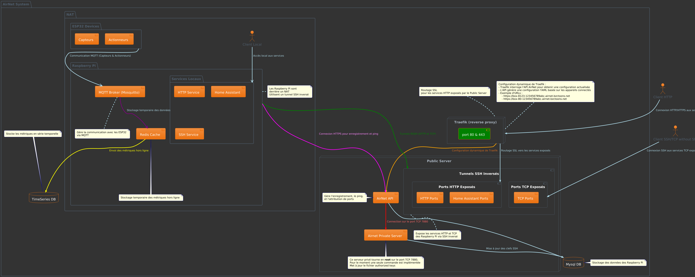
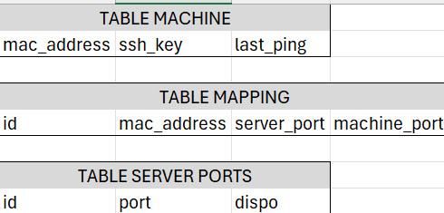

# Projet AirLux

## Sommaire :

- [Architecture globale](#architecture-globale)
- [Versionning : Git](#versionning-projet)
- [API : Laravel](#api)
- [Raspberry](#configuration-rasbery)
- [Server Public : ssh](#connexion-au-serveur-public-en-ssh)
- [Environement : Docker](#docker)
- [Architecture Base de Donnée : MySql](#architecture-de-base-de-données)

## Architecture Globale




## Versionning projet

Utilisation de ghithub comme hébergeur 

Bonne pratique pour collaborer sur le projet :

- [Comment creer une nouvelle branche](apiAirlux/documentation/Comment_creer_une_nouvelle_branche.md)
- [Developpement fonctionnalites](apiAirlux/documentation/developpement_fonctionnalites.md)
- [Gitflow la methodologie et la pratique](apiAirlux/documentation/gitflow_la_methodologie_et_la_pratique)
- [Resolution de conflits](apiAirlux/documentation/resolution_de_conflits.md)

## API

### Route : `/register`

La route /register permet d'enregister un nouvelle appareil.

Si l'appareil existe en base : 
- L'api met à jour la table mapping, cette table permet de savoir quel port de la machine est connecté à quel port du server. 
- L'api met aussi à jour la table server port qui permet de savoir quel port est disponible et que port est indisponible.

Si l'apareil n'existe pas en base : 
- L'api créer la machine en base.
- Créer le mapping des ports.
- Met à jour les ports disponibles.

Dans les 2 cas l'api renvoie ensuite la liste des ports attribués

Quand une machine accède à la route register, alors l'api doit mettre à jour la liste des clés ssh du server.

#### Les difficultés rencontrées

##### 1 - Le server se lance mais se ferme au bout d'environ 10 seconde.

###### Problème
Effectivement il m'est arrivé que lorsque je lance le server il s'éteigne tout seul au boût d'environ 10 secondes voir moins. Lorsque le server est lancé il affiche une erreur pour dire qu'il ne trouve pas le fichier server.php dans le dossier :
```path
apiAirlux\vendor\laravel\framework\src\Illuminate\Console\resources\server.php
```

###### Solution
J'avais Avast antivirus.. Depuis que je l'ai supprimé mes problèmes se sont envolés et vous devriez faire pareil. Plus serieusement faite attention si vous avez le même genre de problème pensez à désactiver votre antivirus. 

Une autre solution aurait été la commande :
```bash
composer update
```
Pour etre sur que l'installation du dossier /vendor est correcte.

#### To-Do
- [x] Poser la logique de la route
- [ ] Acceder à la route 
- [ ] Faire fonctionner la route (ajout des données en base)
### Route : `/ping` 

La route `/ping` est conçue pour renvoyer un **timestamp**. Ce timestamp peut être utilisé pour mettre à jour la base de données, en remplaçant le timestamp du dernier ping.

---

#### Objectif

- Permettre de récupérer un timestamp via une requête à l'API.
- Utiliser ce timestamp pour mettre à jour le champ du dernier ping dans la base de données.

---

#### Fonctionnement

##### Code de la route `/ping`

```php
<?php

namespace App\Http\Controllers;

use App\Http\Controllers\Controller;

class PingController extends Controller
{
    public function ping() {
        return response()->json(['timestamp' => time()], 200);
    }
}
```

À faire (To-Do)

1.Tester que l’API renvoie bien le timestamp
- [ ] Envoyer une requête à la route /ping.
- [ ] Vérifier que la réponse contient un champ "timestamp" avec une valeur correcte (par exemple, en utilisant Postman ou cURL).

2.Mettre à jour la base de données
- [ ] Identifier la table et le champ à mettre à jour (exemple : last_ping dans une table devices).
- [ ] Implémenter la logique pour insérer le timestamp reçu dans la base de données.

Exemple de test avec cURL : 

```bash
curl -X GET http://domaine/api/ping
```
Réponse attendue :

```json
{
    "timestamp": 1701025076
}
```

##### Améliorations possibles :
   - Mettre en place les Merge request pour éviter les régressions ou conflits majeurs.
   - Créer une branche test.
   - Mettre en place des versions lors de maj de la branche production.


## Configuration Rasbery

- Dans le fichier compose.yaml, création d'une image débian  nommée Debian_Rasbery dans le dossier docker/compose.yaml
- Ajout script bash  register.sh pour attiter des ports public  lors de la première connexion  de la Rasbery au serveur public.

### Taches à faire:
 - [ ] Configurer le endpoint de l'api 
 - [ ] Installer  supervisor pour gérer les services qui seront exposés. 
 - [ ] Installer différents services avec des ports http et TCP

## Connexion au serveur public en ssh 

- Générer  en local  sa clé publique et privée à l'aide de la commande :
``` 
        ssh-keygen 
```
 par défaut le protocole utilisé est RSA

- Copier la clé publique du local vers  le serveur  en utilisant la commande :
```
        ssh-copy-id utilisateur_distant@adresse_IP_distante
```
- la clé publique sera automatiquement ajoutée dans le fichier authorized_keys
- Il serait intéressant de créer et de paramétrer un fichier de configuration  pour personnaliser et améliorer le client SSH.

Voici une version bien organisée et formatée pour un fichier .md :

## Docker

### Création des containers

- **Nginx**  
  Un container pour gérer le serveur web.  

- **PHP**  
  Un container pour exécuter les scripts PHP.

---

### Difficultés rencontrées

### Problème : container Laravel
- Lors du `docker compose build`, une erreur est survenue.
- Hypothèse : le problème pourrait venir du fichier `Dockerfile`.

---

### Commandes utiles

### Lancer les containers :
```bash
docker compose up
```
Arrêter les containers :

```bash
docker compose down
```
Port

  - Le serveur est accessible sur le port 8000.

To-Do

  - [ ]	Créer un container Laravel pour que les collègues puissent travailler.

Note personnelle

  PS : Je retarde tout, je crois :/

## Architecture de Base de Données



Vous pouvez aussi suivre [ce lien](https://www.notion.so/6ac655df33a44836aeef01e4056a4ee3?v=9fdcd77b65604064a43957e4adb4cd58&p=137a89b0cc0080c9b050e008037f86df&pm=s) pour en savoir plus 
